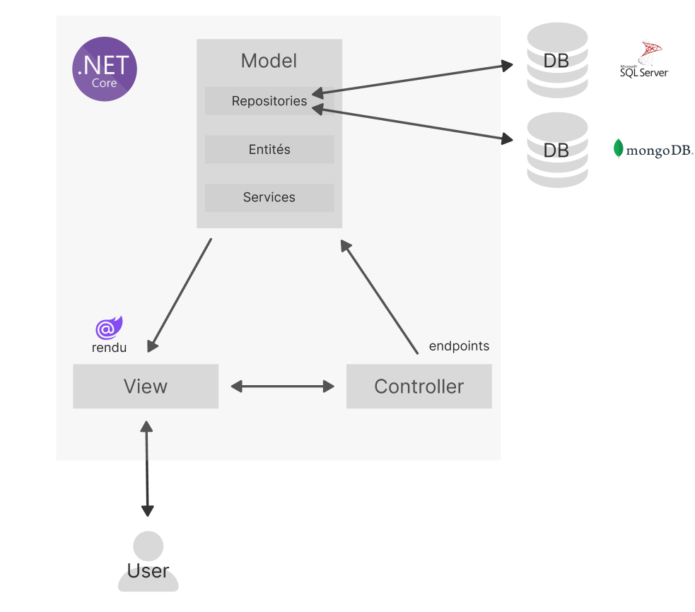
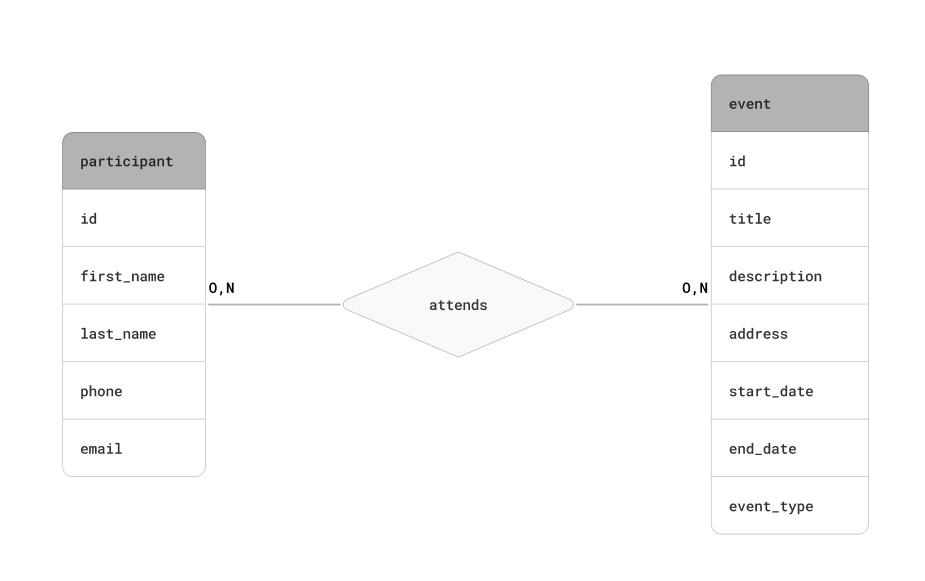
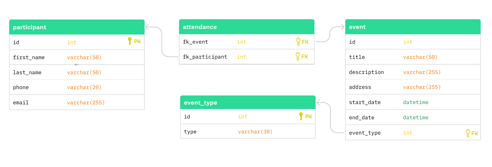

# ECF2

## Diagrammes

### Architecture

Il s'agit d'une architecture de type MVC (Model-View-Controller)

### MCD (modèle conceptuel des données)

### MPD (modèle physique des données)

Ce modèle tient compte des limitations du SGBDR : il n'existe pas de type enum en SQL server